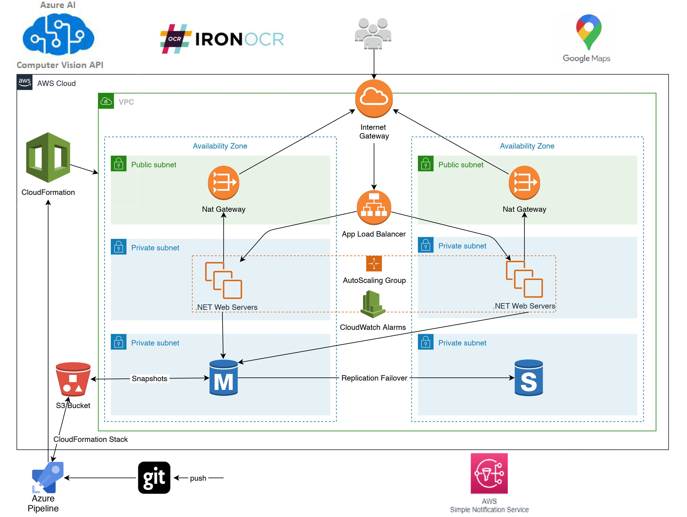

## Architecture Diagram

## Project Overview

For my final year college project I am working on a live project with CSinc.ie, which is a team made up of lecturers from the TU Dublin, Tallaght campus. This team of lecturers take bookings from schools and organisations all over Ireland, providing computer science outreach camps to students and personal development camps to teachers. My role is to design, develop, implement and test a full-stack booking system for the organisation, which can handle thousands of bookings. This booking system will allow schools and organizations to browse available camp dates and then make a booking. I will implement a notification system which will send either an email or a text message to camp lecturers when a booking is made by a school or organization. I will use the AWS Simple Notification Service to facilitate this. 
 
The booking process will be made as simple as possible for schools; once the school enters in their unique school roll number, the rest of the school’s information will be filled out automatically i.e. school name, address, Eircode, phone number, email etc. The school will be asked for additional information such as start and end time for camp, class groups (6th class, 4th year etc.), topics to be covered, and also if they would like to opt-in to take part in surveys.  
 
These longitudinal surveys will help lecturers improve and transform their approach/techniques, which will help develop the camps moving forward and in turn, allow lecturers to reach and inform as many students as possible, of what computer science really is, addressing stereotypes and incorrect perceptions of the subject. There will be a student survey and a separate teacher survey, optimizing research scope. The research will inform the team on pedagogical development, content and activity development. Due to the high number of surveys, and the fact that they need to be handwritten to get parental consent, I will need to automate the process of the extraction of survey data into our database. Lecturers will be able to scan and then upload all of a schools handwritten paper surveys onto the system in PDF format. Thus automating the manual process of extracting data from thousands of surveys per year and entering the data into a database for research & analytical purposes.  
 
There are two types of data that need to be extracted, which makes the process more complex: both handwritten text answer data and checkbox mark answer data. I will leverage an AI/ML Optical Character Recognition API to help parse pictures of handwritten text into ASCII characters. Regarding the extraction of marks from checkboxes; I have implemented my own solid logic and algorithms to extract marks from all survey checkboxes i.e. to determine if a checkbox has been marked or not, a comparison of a base un-marked pixel density value against an incoming pixel density value needs to be made. Each survey page will have its own in-memory data dictionary of checkbox information for all of its checkboxes e.g. each dictionary key will be a checkbox name and dictionary value with be a checkbox object containing a checkboxes X, Y box location and its un-marked pixel density. I implemented logic and algorithms which will loop through a checkbox dictionary, moving pixel by pixel over each checkbox X, Y location, while measuring the pixel density and measuring it against the checkboxes un-marked base pixel density value, to determine if a checkbox has been marked or not. 
 
In order to make sure that the survey data being entered into the database is correct and reliable; during the extraction process the system will carry out validation on the extracted data by flagging possible survey errors, such as too many or too few checkboxes marked, or unreadable/blank answer textboxes. Lecturers will then be able to validate the flagged surveys by viewing a list of all of a schools flagged surveys. They can then open each flagged survey separately, view the flagged surveys flagged questions and compare them against a view which contains the actual uploaded PDF file (lecturers can also open the corresponding survey PDF in a separate window if required). Lecturers can then fix or mitigate each survey error and enter the survey back into the database with the correct data. 
 
I will also implement an Upload feature which will allow lecturers to populate the schools databases with live datasets from the gov.cso website. These datasets contain a wealth of information on every secondary school in Ireland, which will be used throughout the booking system in various ways to add to the usability of the booking system and also to add dynamicity to some of the booking system features e.g. pre-population of school booking forms, feeding school lat/lon values into Google Maps for camp directions and more.  I will use 2 secondary school datasets which are updated every few months with new or updated school information. Lecturers can then use this upload feature to update the school databases when required. 
 
In regard to the booking system itself; all expected CRUD operations will be facilitated i.e. CRUD for available camp dates, active camp bookings, completed camp bookings, surveys. Lecturers can manage available camp dates e.g. each lecturer can add dates for which they are available for school camps. The dates that lecturers add onto the system will then be available for schools and organizations to book. Lecturers will be able to view a list of active camp bookings which contain detailed school information, including integrated Google Maps directions to each school camp. Lecturers can mark an active booking as complete once the school camp has been successfully completed. This will move the school booking from the active bookings database to the completed camp database which provides more features e.g. upload surveys, validate surveys and view a full list of a schools extracted survey data.
